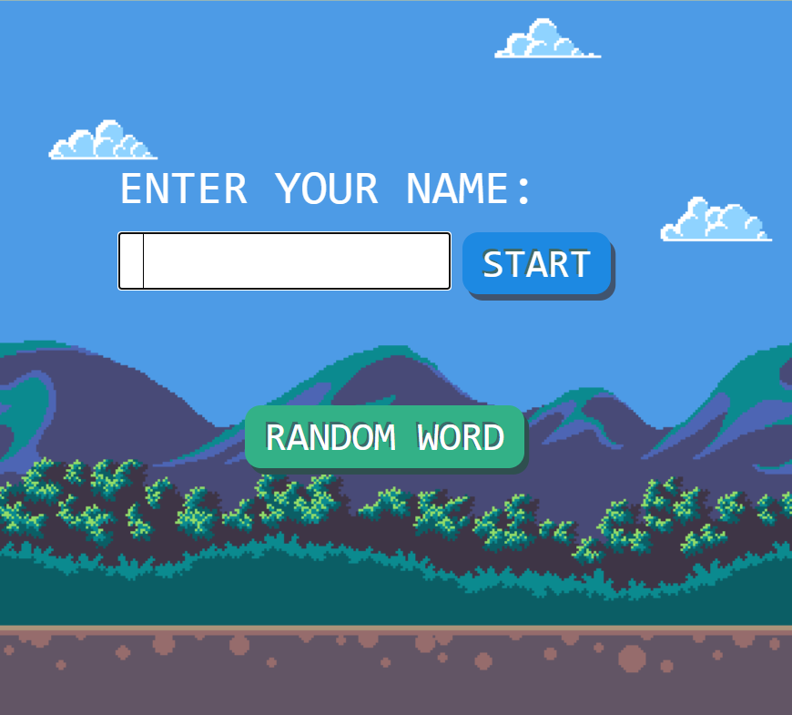
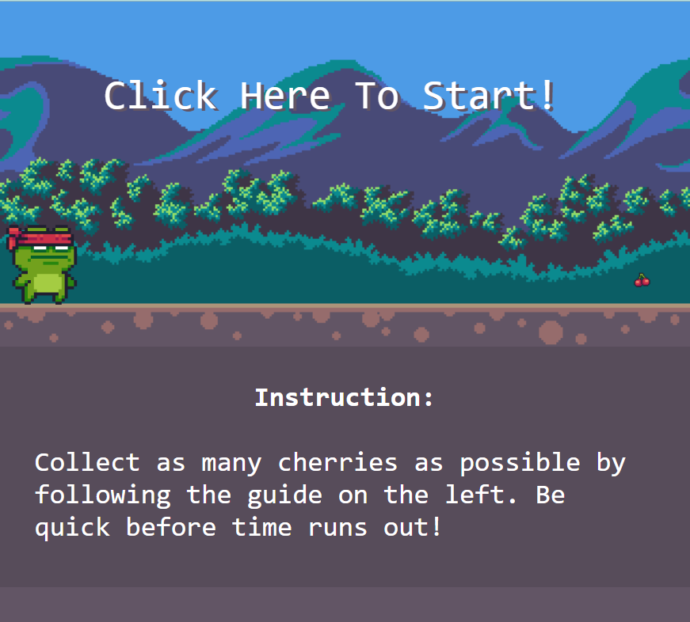
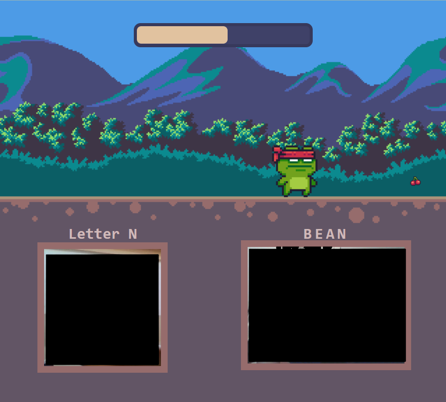
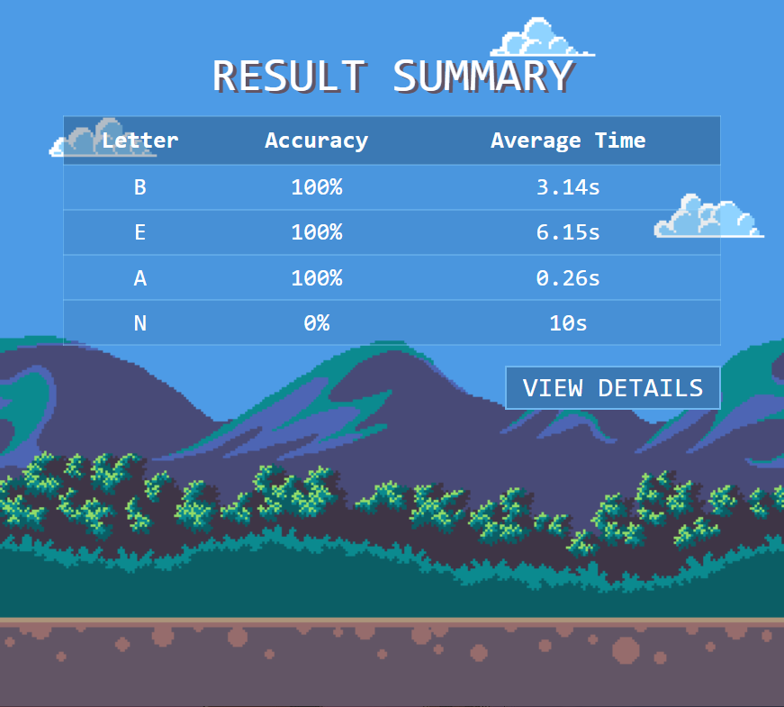

# uid-asl-learning

Live [here](https://sluong910.github.io/uid-asl-learning/). Resize your screen to fit. 

     &emsp;
    

     &emsp;
    

 

2D image assets from  
[pixel adventure](https://pixelfrog-assets.itch.io/pixel-adventure-1) 
[draconimous](https://draconimous.itch.io/free-platform-tileset) 

Kaggle [dataset](https://www.kaggle.com/datasets/grassknoted/asl-alphabet)
